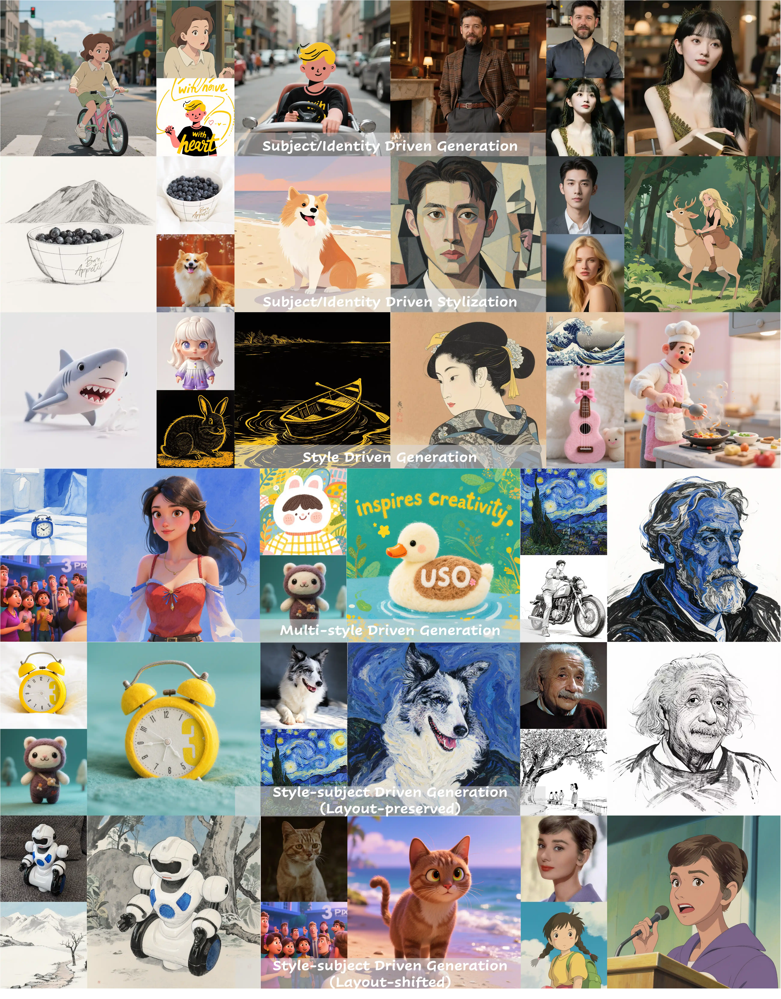

<h3 align="center">
    
    </br>
    Unified Style and Subject-Driven Generation via Disentangled and Reward Learning
</h3>

<p align="center"> 
<a href="https://github.com/bytedance/USO"></a> 
<a href="https://bytedance.github.io/USO/"></a> 
<a href="https://arxiv.org/abs/2508.18966"></a>
<a href="https://huggingface.co/bytedance-research/USO"></a>
</p>

><p align="center"> <span style="color:#137cf3; font-family: Gill Sans">Shaojin Wu,</span><sup></sup></a>  <span style="color:#137cf3; font-family: Gill Sans">Mengqi Huang</span>,</a> <span style="color:#137cf3; font-family: Gill Sans">Yufeng Cheng,</span><sup></sup></a>  <span style="color:#137cf3; font-family: Gill Sans">Wenxu Wu,</span><sup></sup> </a> <span style="color:#137cf3; font-family: Gill Sans">Jiahe Tian,</span><sup></sup></a> <span style="color:#137cf3; font-family: Gill Sans">Yiming Luo,</span><sup></sup></a> <span style="color:#137cf3; font-family: Gill Sans">Fei Ding</span>,</a> <span style="color:#137cf3; font-family: Gill Sans">Qian He</span></a> <br> 
><span style="font-size: 13.5px">UXO Team</span><br> 
><span style="font-size: 12px">Intelligent Creation Lab, Bytedance</span></p>

<p align="center">
    
<p>

## 🔥 News
We're hurrying to get everything ready—please stay tuned. ✨
* **2025.08.27** 🔥 The [project page](https://bytedance.github.io/USO) of USO is created.
* **2025.08.27** 🔥 The [technical report](https://arxiv.org/abs/2508.18966) of USO is released.

## 📖 Introduction
Existing literature typically treats style-driven and subject-driven generation as two disjoint tasks: the former prioritizes stylistic similarity, whereas the latter insists on subject consistency, resulting in an apparent antagonism. We argue that both objectives can be unified under a single framework because they ultimately concern the disentanglement and re-composition of “content” and “style”, a long-standing theme in style-driven research. To this end, we present USO, a Unified framework for Style driven and subject-driven GeneratiOn. First, we construct a large-scale triplet dataset consisting of content images, style images, and their corresponding stylized content images. Second, we introduce a disentangled learning scheme that simultaneously aligns style features and disentangles content from style through two complementary objectives, style-alignment training and content–style disentanglement training. Third, we incorporate a style reward-learning paradigm to further enhance the model’s performance.


## 📄 Disclaimer
<p>
  We open-source this project for academic research. The vast majority of images 
  used in this project are either generated or from open-source datasets. If you have any concerns, 
  please contact us, and we will promptly remove any inappropriate content. 
  Our project is released under the Apache 2.0 License. If you apply to other base models, 
  please ensure that you comply with the original licensing terms. 
  <br><br>This research aims to advance the field of generative AI. Users are free to 
  create images using this tool, provided they comply with local laws and exercise 
  responsible usage. The developers are not liable for any misuse of the tool by users.</p>

## 🚀 Updates
For the purpose of fostering research and the open-source community, we plan to open-source the entire project, encompassing training, inference, weights, dataset etc. Thank you for your patience and support! 🌟
- [x] Release technical report.
- [x] Release github repo.
- [] Release inference code.
- [] Release model checkpoints.
- [] Release huggingface space demo.
- [] Release training code.
- [] Release dataset.

##  Citation
If USO is helpful, please help to ⭐ the repo.

If you find this project useful for your research, please consider citing our paper:
```bibtex
@article{wu2025uso,
    title={USO: Unified Style and Subject-Driven Generation via Disentangled and Reward Learning},
    author={Shaojin Wu and Mengqi Huang and Yufeng Cheng and Wenxu Wu and Jiahe Tian and Yiming Luo and Fei Ding and Qian He},
    year={2025},
    eprint={2508.18966},
    archivePrefix={arXiv},
    primaryClass={cs.CV},
}
```